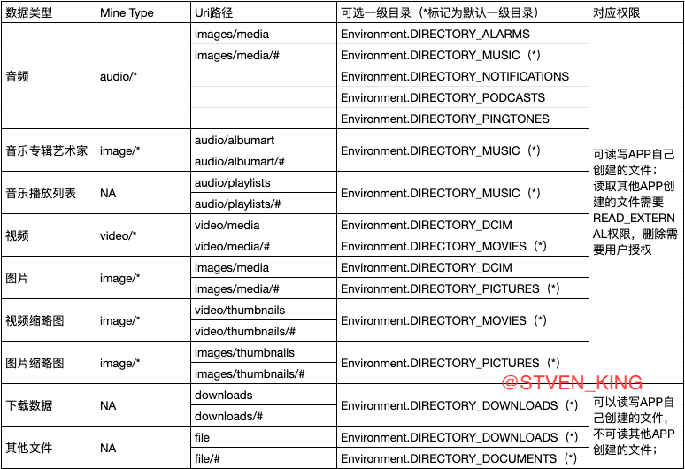
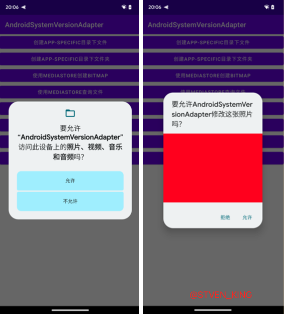
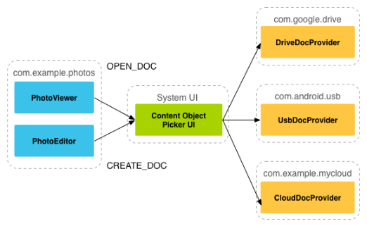

# AndroidQ

[Android 10 中的隐私权变更](https://developer.android.com/about/versions/10/privacy/changes) 

|      | 隐私权变更                                                   | 受影响的应用                         | 缓解策略                                                     |
| :--- | :----------------------------------------------------------- | :----------------------------------- | ------------------------------------------------------------ |
| ✅    | **分区存储** 针对外部存储的过滤视图，可提供对特定于应用的文件和媒体集合的访问权限 | 访问和共享外部存储中的文件的应用     | 使用特定于应用的目录和媒体集合目录 [了解详情](https://developer.android.com/about/versions/10/privacy/changes#scoped-storage) |
| ✅    | **增强了用户对位置权限的控制力** 仅限前台权限，可让用户更好地控制应用对设备位置信息的访问权限 | 在后台时请求访问用户位置信息的应用   | 确保在没有后台位置信息更新的情况下优雅降级 使用 Android 10 中引入的权限在后台获取位置信息 [了解详情](https://developer.android.com/about/versions/10/privacy/changes#app-access-device-location) |
| ✅    | **系统执行后台 Activity** 针对从后台启动 Activity 实施了限制 | 不需要用户互动就启动 Activity 的应用 | 使用通知触发的 Activity [了解详情](https://developer.android.com/about/versions/10/privacy/changes#background-activity-starts) |
| ✅    | **不可重置的硬件标识符** 针对访问设备序列号和 IMEI 实施了限制 | 访问设备序列号或 IMEI 的应用         | 使用用户可以重置的标识符 [了解详情](https://developer.android.com/about/versions/10/privacy/changes#non-resettable-device-ids) |
| ✅    | **无线扫描权限** 访问某些 WLAN、WLAN 感知和蓝牙扫描方法需要获得精确位置权限 | 使用 WLAN API 和蓝牙 API 的应用      | 针对相关使用场景请求 `ACCESS_FINE_LOCATION` 权限 [了解详情](https://developer.android.com/about/versions/10/privacy/changes#location-telephony-bluetooth-wifi) |

上面是官网的AndroidQ的隐私权变更链接，本文章只针对部分重大隐私权限变更做出解释说明。

## [从后台启动 Activity 的限制 ](https://developer.android.com/guide/components/activities/background-starts)

[创建高优先级通知](https://developer.android.com/training/notify-user/time-sensitive)

Android10中, 当App无前台显示的Activity时,其启动Activity会被系统拦截, 导致启动无效。
对此官方给予的折中方案是使用全屏`Intent(full-screen intent)`, 既创建通知栏通知时, 加入`full-screen intent `设置, 示例代码如下(基于官方文档修改):

```java
		Intent fullScreenIntent = new Intent(this, CallActivity.class);
    PendingIntent fullScreenPendingIntent = PendingIntent.getActivity(this, 0,
            fullScreenIntent, PendingIntent.FLAG_UPDATE_CURRENT);

    NotificationCompat.Builder notificationBuilder =
            new NotificationCompat.Builder(this, CHANNEL_ID)
        .setSmallIcon(R.drawable.notification_icon)
        .setContentTitle("Incoming call")
        .setContentText("(919) 555-1234")
        .setPriority(NotificationCompat.PRIORITY_HIGH)
        .setCategory(NotificationCompat.CATEGORY_CALL)

        // Use a full-screen intent only for the highest-priority alerts where you
        // have an associated activity that you would like to launch after the user
        // interacts with the notification. Also, if your app targets Android 10
        // or higher, you need to request the USE_FULL_SCREEN_INTENT permission in
        // order for the platform to invoke this notification.
        .setFullScreenIntent(fullScreenPendingIntent, true);

    Notification incomingCallNotification = notificationBuilder.build();
```

**注意：在Target SDk为29及以上时,需要在AndroidManifest上增加USE_FULL_SCREEN_INTENT申明**

```xml
//AndroidManifest中
<uses-permission android:name="android.permission.USE_FULL_SCREEN_INTENT" />
```

当手机处于亮屏状态时, 会显示一个通知栏, 当手机处于锁屏或者灭屏状态时，会亮屏并直接进入到`CallActivity`中。

## [不可重置的设备标识符实施了限制](https://developer.android.com/about/versions/10/privacy/changes#non-resettable-device-ids)

从 Android 10 开始，应用必须具有 `READ_PRIVILEGED_PHONE_STATE` 特许权限才能访问设备的不可重置标识符（包含 IMEI 和序列号）。

受影响的方法包括：

- ```
  Build
  ```

  - [`getSerial()`](https://developer.android.com/reference/android/os/Build#getSerial())

- ```
  TelephonyManager
  ```

  - [`getImei()`](https://developer.android.com/reference/android/telephony/TelephonyManager#getImei(int))
  - [`getDeviceId()`](https://developer.android.com/reference/android/telephony/TelephonyManager#getDeviceId(int))
  - [`getMeid()`](https://developer.android.com/reference/android/telephony/TelephonyManager#getMeid(int))
  - [`getSimSerialNumber()`](https://developer.android.com/reference/android/telephony/TelephonyManager#getSimSerialNumber())
  - [`getSubscriberId()`](https://developer.android.com/reference/android/telephony/TelephonyManager#getSubscriberId())

> ANDROID_ID 生成规则：签名+设备信息+设备用户
> ANDROID_ID 重置规则：设备恢复出厂设置时，ANDROID_ID 将被重置
>
> 当前获取设备唯一ID的方式为使用ANDROID_ID, 若获取为空的话则使用UUID.randomUUID().toString()获得一个随机ID并存储起来, 该ID保证唯一, 但App卸载重装之后就会改变。
>
> ```java
> String id = android.provider.Settings.Secure.getString(context.getContentResolver(), android.provider.Settings.Secure.ANDROID_ID);
> 
> ```

## [限制了对剪贴板数据的访问权限](https://developer.android.com/about/versions/10/privacy/changes#clipboard-data)

除非您的应用是默认[输入法 (IME)](https://developer.android.com/guide/topics/text/creating-input-method) 或是目前处于焦点的应用，否则它无法访问 Android 10 或更高版本平台上的剪贴板数据。

> 因为都是应用处于前台的时候进行剪贴板数据的获取，对于大部分业务不受影响。

## 定位权限

 `Android Q`引入了新的位置权限`ACCESS_BACKGROUND_LOCATION`，该权限仅会影响应用在后台运行时对位置信息的访问权。如果应用`targetSDK<=P`，请求了`ACCESS_FINE_LOCATION`或`ACCESS_COARSE_LOCATION`权限，`AndroidQ`设备会自动帮你申请`ACCESS_BACKGROUND_LOCATION`权限。
如果应用以` Android 10`或更高版本为目标平台，则您必须在应用的清单文件中声明`ACCESS_BACKGROUND_LOCATION`权限并接收用户权限，才能在应用位于后台时接收定期位置信息更新。
以下代码段展示了如何在应用中请求在后台访问位置信息：

```xml
    <manifest ... >
        <!--允许获得精确的GPS定位-->
        <uses-permission android:name="android.permission.ACCESS_FINE_LOCATION"/>
        <!--允许获得粗略的基站网络定位-->
        <uses-permission android:name="android.permission.ACCESS_COARSE_LOCATION"/>
        <!-- 兼容10.0系统，允许App在后台获得位置信息 -->
        <uses-permission android:name="android.permission.ACCESS_BACKGROUND_LOCATION"/>
    </manifest>
```

以下代码段中显示了定位权限检查逻辑的示例：

```java
    boolean permissionAccessCoarseLocationApproved =
        ActivityCompat.checkSelfPermission(this, permission.ACCESS_COARSE_LOCATION)
            == PackageManager.PERMISSION_GRANTED;
 
    if (permissionAccessCoarseLocationApproved) {
       boolean backgroundLocationPermissionApproved =
               ActivityCompat.checkSelfPermission(this,
                   permission.ACCESS_BACKGROUND_LOCATION)
                   == PackageManager.PERMISSION_GRANTED;
 
       if (backgroundLocationPermissionApproved) {
           // App can access location both in the foreground and in the background.
           // Start your service that doesn't have a foreground service type
           // defined.
       } else {
           // App can only access location in the foreground. Display a dialog
           // warning the user that your app must have all-the-time access to
           // location in order to function properly. Then, request background
           // location.
           ActivityCompat.requestPermissions(this, new String[] {
               Manifest.permission.ACCESS_BACKGROUND_LOCATION},
               your-permission-request-code);
       }
    } else {
       // App doesn't have access to the device's location at all. Make full request
       // for permission.
       ActivityCompat.requestPermissions(this, new String[] {
            Manifest.permission.ACCESS_COARSE_LOCATION,
            Manifest.permission.ACCESS_BACKGROUND_LOCATION
            },
            your-permission-request-code);
    }
```

如果您的应用通常需要在被置于后台后（如当用户按设备上的主屏幕按钮或关闭设备的显示屏时）访问设备的位置信息。             

要在这种特定类型的用例中保留对设备位置信息的访问权，请启动您已在应用的清单中声明前台服务类型为 "location" 的前台服务：

```xml
    <service
        android:name="MyNavigationService"
        android:foregroundServiceType="location" ... >
        ...
    </service>
```

 在启动该前台服务之前，请确保您的应用仍可访问设备的位置信息：

```java
    boolean permissionAccessCoarseLocationApproved =
        ActivityCompat.checkSelfPermission(this,
            permission.ACCESS_COARSE_LOCATION) ==
            PackageManager.PERMISSION_GRANTED;
    if (permissionAccessCoarseLocationApproved) {
        // App has permission to access location in the foreground. Start your
        // foreground service that has a foreground service type of "location".
    } else {
       // Make a request for foreground-only location access.
       ActivityCompat.requestPermissions(this, new String[] {
            Manifest.permission.ACCESS_COARSE_LOCATION},
           your-permission-request-code);
    }
```

## 分区存储

为了让用户更好地控制自己的文件，并限制文件混乱的情况，Android Q修改了APP访问外部存储中文件的方法。外部存储的新特性被称为`Scoped Storage`。

Android Q仍然使用`READ_EXTERNAL_STORAGE`和`WRITE_EXTERNAL_STORAGE`作为面向用户的存储相关运行时权限，但现在即使获取了这些权限，访问外部存储也受到了限制。

APP需要这些运行时权限的情景发生了变化，且各种情况下外部存储对APP的可见性也发生了变化。

在`Scoped Storage`新特性中，外部存储空间被分为两部分：

● 公共目录：`Downloads`、`Documents`、`Pictures`、`DCIM`、`Movies`、`Music`、`Ringtones`等

  公共目录下的文件在APP卸载后，不会删除。

  APP可以通过`SAF(System Access Framework)`、`MediaStore`接口访问其中的文件。

● `App-specific`目录：存储应用私有数据，外部存储应用私有目录对应 Android/data/packagename，内部存储应用私有目录对应 data/data/packagename；

  APP卸载后，数据会清除。

  APP的私密目录，APP访问自己的`App-specific`目录时无需任何权限。


### 存储空间视图模式

Android Q规定了APP有两种外部存储空间视图模式：`Legacy View`、`Filtered View`。

● `Filtered View`：App可以直接访问`App-specific`目录，但不能直接访问`App-specific`外的文件。访问公共目录或其他APP的`App-specific`目录，只能通过`MediaStore`、`SAF`、或者其他APP 提供的`ContentProvider`、`FileProvider`等访问。

● `Legacy View`：  兼容模式。与Android Q以前一样，申请权限后App可访问外部存储，拥有完整的访问权限

#### requestLegacyExternalStorage和preserveLegacyExternalStorage

`requestLegacyExternalStorage` 是Anroid10引入的，如果你进行适配Android 10之后，应用通过升级安装，那么还会使用以前的储存模式`Legacy View`，只有通过首次安装或是卸载重新安装才能启用新模式`Filtered View`。

而`android:requestLegacyExternalStorage="true"`让适配了Android10的app新安装在Android 10系统上也继续访问旧的存储模型。

```java
Environment.isExternalStorageLegacy();//存储是否为兼容模式
```

在适配Android11的时候`requestLegacyExternalStorage` 标签会在Android11以上的设备上被忽略，`preserveLegacyExternalStorage`只是让覆盖安装的app能继续使用旧的存储模型，如果之前是旧的存储模型的话。

- Android10适配的时候可以通过`requestLegacyExternalStoragec`使用兼容模式；
- Android11适配可以通过`preserveLegacyExternalStorage`让Android10及一下的设备使用兼容模式，但Android11及以上的设备无论是覆盖安装还是重新安装都无法使用兼容模式；

可以通过调用 [`Environment.getExternalStorageState()`](https://developer.android.com/reference/android/os/Environment#getExternalStorageState()) 查询该卷的状态。如果返回的状态为 [`MEDIA_MOUNTED`](https://developer.android.com/reference/android/os/Environment#MEDIA_MOUNTED)，那么您就可以在外部存储空间中读取和写入应用专属文件。如果返回的状态为 [`MEDIA_MOUNTED_READ_ONLY`](https://developer.android.com/reference/android/os/Environment#MEDIA_MOUNTED_READ_ONLY)，您只能读取这些文件。

### 分区存储的影响

#### 图片位置信息

一些图片会包含位置信息，因为位置对于用户属于敏感信息， Android 10 应用在分区存储模式下图片位置信息默认获取不到，应用通过以下两项设置可以获取图片位置信息：

- 在 `manifest` 中申请 `ACCESS_MEDIA_LOCATION`;
- 调用 `MediaStore.setRequireOriginal(Uri uri)`接口更新图片 `Uri`;

```kotlin
// Get location data from the ExifInterface class.
val photoUri = MediaStore.setRequireOriginal(photoUri)
contentResolver.openInputStream(photoUri).use { stream ->
    ExifInterface(stream).run {
        // If lat/long is null, fall back to the coordinates (0, 0).
        val latLong = ?: doubleArrayOf(0.0, 0.0)
    }
}
```

#### 访问数据

##### 私有目录：

应用私有目录文件访问方式与之前 Android 版本一致，可以通过 File path 获取资源。

##### 共享目录:

共享目录文件需要通过 `MediaStore API` 或者 `Storage Access Framework` 方式访问。
`MediaStore API` 在共享目录指定目录下创建文件或者访问应用自己创建文件，不需要申请存储权限
`MediaStore API` 访问其他应用在共享目录创建的媒体文件(图片、音频、视频)， 需要申请存储权限，未申请存储权限，通过 `ContentResolver` 查询不到文件 Uri，即使通过其他方式获取到文件 Uri，读取或创建文件会抛出异常；
`MediaStore API` 不能够访问其他应用创建的非媒体文件(pdf、office、doc、txt 等)， 只能够通过 `Storage Access Framework` 方式访问；

#### File路径访问受影响接口

> `FileOutputStream`和`FileInputStream`

在分区存储模型下，SD卡的公共目录是不让访问的，除了共享媒体的那几个文件夹。所以，用一个公共目录的路径**实例化**`FileOutputStream`或者`FileInputStream`会`报FileNotFoundException`异常。

```java
W/System.err: java.io.FileNotFoundException: /storage/emulated/0/Log01-28-18-10.txt: open failed: EACCES (Permission denied)
W/System.err:     at libcore.io.IoBridge.open(IoBridge.java:496)
W/System.err:     at java.io.FileInputStream.<init>(FileInputStream.java:159)
```

> `File.createNewFile`

```java
W/System.err: java.io.IOException: Permission denied
W/System.err:     at java.io.UnixFileSystem.createFileExclusively0(Native Method)
W/System.err:     at java.io.UnixFileSystem.createFileExclusively(UnixFileSystem.java:317)
W/System.err:     at java.io.File.createNewFile(File.java:1008)
```

- `File.renameTo`
- `File.delete`
- `File.renameTo`
- `File.mkdir`
- `File.mkdirs`

以上`File`的方法都返回`false`。

> `BitmapFactory.decodeFile`生成的`Bitmap`为`null`。

### 适配指导

`Android Q Scoped Storage`新特性谷歌官方适配文档：https://developer.android.google.cn/preview/privacy/scoped-storage

适配指导如下，分为：访问APP自身App-specific目录文件、使用MediaStore访问公共目录、使用SAF 访问指定文件和目录、分享App-specific目录下文件和其他细节适配。

#### 访问App-specific目录文件

无需任何权限，可以直接通过File的方式操作App-specific目录下的文件。

| App-specific目录 | 接口（所有存储设备）              | 接口（Primary External Storage） |
| ---------------- | --------------------------------- | -------------------------------- |
| Media            | getExternalMediaDirs()            | NA                               |
| Obb              | getObbDirs()                      | getObbDir()                      |
| Cache            | getExternalCacheDirs()            | getExternalCacheDir()            |
| Data             | getExternalFilesDirs(String type) | getExternalFilesDir(String type) |

```kotlin
/**
 * 在App-Specific目录下创建文件
 * 文件目录：/Android/data/包名/files/Documents/
 */
private fun createAppSpecificFile() {
    binding.createAppSpecificFileBtn.setOnClickListener {
        val documents = getExternalFilesDirs(Environment.DIRECTORY_DOCUMENTS)
        if (documents.isNotEmpty()) {
            val dir = documents[0]
            var os: FileOutputStream? = null
            try {
                val newFile = File(dir.absolutePath, "MyDocument")
                os = FileOutputStream(newFile)
                os.write("create a file".toByteArray(Charsets.UTF_8))
                os.flush()
                Log.d(TAG, "创建成功")
                dir.listFiles()?.forEach { file: File? ->
                    if (file != null) {
                        Log.d(TAG, "Documents 目录下的文件名：" + file.name)
                    }
                }
            } catch (e: IOException) {
                e.printStackTrace()
                Log.d(TAG, "创建失败")

            } finally {
                closeIO(os)
            }

        }
    }
}
/**
 * 在App-Specific目录下创建文件夹
 * 文件目录：/Android/data/包名/files/
 */
private fun createAppSpecificFolder() {
    binding.createAppSpecificFolderBtn.setOnClickListener {
        getExternalFilesDir("apk")?.let {
            if (it.exists()) {
                Log.d(TAG, "创建成功")
            } else {
                Log.d(TAG, "创建失败")
            }
        }
    }
}
```

####  使用MediaStore访问公共目录

##### MediaStore Uri和路径对应表


MediaStore提供下列Uri，可以用MediaProvider查询对应的Uri数据。在AndroidQ上，所有的外部存储设备都会被命令，即Volume Name。MediaStore可以通过Volume Name 获取对应的Uri。

```kotlin
MediaStore.getExternalVolumeNames(this).forEach { volumeName ->
  Log.d(TAG, "uri：${MediaStore.Images.Media.getContentUri(volumeName)}")
}
```

Uri路径格式： `content:// media/<volumeName>/<Uri路径>`



##### 使用MediaStore创建文件

通过ContentResolver的insert方法，将多媒体文件保存在公共集合目录，不同的Uri对应不同的公共目录，详见3.2.1；其中RELATIVE_PATH的一级目录必须是Uri对应的一级目录，二级目录或者二级以上的目录，可以随意的创建和指定。

```kotlin
private lateinit var createBitmapForActivityResult: ActivityResultLauncher<String>
//注册ActivityResultLauncher
createBitmapForActivityResult =
    registerForActivityResult(ActivityResultContracts.RequestPermission()) {
        createBitmap()
    }
binding.createFileByMediaStoreBtn.setOnClickListener {
    createBitmapForActivityResult.launch(Manifest.permission.WRITE_EXTERNAL_STORAGE)
}
private fun createBitmap() {
    val values = ContentValues()
    val displayName = "NewImage.png"
    values.put(MediaStore.Images.Media.DISPLAY_NAME, displayName)
    values.put(MediaStore.Images.Media.DESCRIPTION, "This is an image")
    values.put(MediaStore.Images.Media.MIME_TYPE, "image/png")
    values.put(MediaStore.Images.Media.TITLE, "Image.png")
    //适配AndroidQ及一下
    if (Build.VERSION.SDK_INT >= Build.VERSION_CODES.Q) {
        values.put(MediaStore.Images.Media.RELATIVE_PATH, "Pictures/sl")
    } else {
        values.put(
            MediaStore.MediaColumns.DATA,
            "${Environment.getExternalStorageDirectory().path}/${Environment.DIRECTORY_DCIM}/$displayName"
        )
    }
    //requires android.permission.WRITE_EXTERNAL_STORAGE, or grantUriPermission()
    val external = MediaStore.Images.Media.EXTERNAL_CONTENT_URI
    //java.lang.UnsupportedOperationException: Writing to internal storage is not supported.
    //val external = MediaStore.Images.Media.INTERNAL_CONTENT_URI
    val insertUri = contentResolver.insert(external, values)
    var os: OutputStream? = null
    try {
        if (insertUri != null) {
            os = contentResolver.openOutputStream(insertUri)
        }
        if (os != null) {
            val bitmap = Bitmap.createBitmap(400, 400, Bitmap.Config.ARGB_8888)
            //创建了一个红色的图片
            val canvas = Canvas(bitmap)
            canvas.drawColor(Color.RED)
            bitmap.compress(Bitmap.CompressFormat.PNG, 90, os)
            Log.d(TAG, "创建Bitmap成功")
            if (insertUri != null) {
                values.clear()
                //适配AndroidQ及一下
                if (Build.VERSION.SDK_INT >= Build.VERSION_CODES.Q) {
                    values.put(MediaStore.Images.Media.RELATIVE_PATH, "Pictures/sl2")
                } else {
                    values.put(
                        MediaStore.MediaColumns.DATA,
                        "${Environment.getExternalStorageDirectory().path}/${Environment.DIRECTORY_DCIM}/$displayName"
                    )
                }
                contentResolver.update(insertUri, values, null, null)
            }
        }
    } catch (e: IOException) {
        Log.d(TAG, "创建失败：${e.message}")
    } finally {
        closeIO(os)
    }
}
```

##### 使用MediaStore查询文件

>  通过 `Cursor query(@RequiresPermission.Read @NonNull Uri uri,@Nullable String[] projection, @Nullable String selection,@Nullable String[] selectionArgs, @Nullable String sortOrder)` 方法。

参数解释:

| 参数          | 类型     | 释义                                                         |
| :------------ | :------- | :----------------------------------------------------------- |
| uri           | Uri      | 提供检索内容的 Uri，其 scheme 是`content://`                 |
| projection    | String[] | 返回的列，如果传递 null 则所有列都返回(效率低下)             |
| selection     | String   | 过滤条件，即 SQL 中的 `WHERE` 语句(但不需要写 `where` 本身)，如果传 null 则返回所有的数据 |
| selectionArgs | String[] | 如果你在 selection 的参数加了 `?` 则会被本字段中的数据按顺序替换掉 |
| sortOrder     | String   | 用来对数据进行排序，即 SQL 语句中的 `ORDER BY`(单不需要写`ORDER BY` 本身)，如果传 null 则按照默认顺序排序(可能是无序的) |

通过`ContentResolver.query`接口查询文件`Uri`，查询其他App创建的文件是需要`READ_EXTERNAL_STORAGE`权限；

**该查询使用的是手机系统的数据库查询，可能会出现有些图片文件存在但是依旧查询不到~！（PS：使用adb命令push的图片就查询不到）**

```kotlin
/**
 * 通过MediaStore查询文件
 */
private fun queryFileByMediaStore() {
  queryPictureForActivityResult = registerForActivityResult(ActivityResultContracts.RequestPermission()) {
      queryUri = queryImageUri("yellow.jpg")
  }
  binding.queryFileByMediaStoreBtn.setOnClickListener {
      queryPictureForActivityResult.launch(Manifest.permission.READ_EXTERNAL_STORAGE)
  }
}
/**
  * @param displayName 查询的图片文件名称
  * @return 第一个遍历到的该文件名的uri
  */
private fun queryImageUri(displayName: String): Uri? {
    val external = MediaStore.Images.Media.EXTERNAL_CONTENT_URI
    val selection = "${MediaStore.Images.Media.DISPLAY_NAME}=?"
    val args = arrayOf(displayName)
    val projection = arrayOf(MediaStore.Images.Media._ID)
    val cursor = contentResolver.query(external, projection, selection, args, null)
    var queryUri: Uri? = null
    if (cursor != null) {
        //可能查询到多个同名图片
        while (cursor.moveToNext()) {
            queryUri = ContentUris.withAppendedId(external, cursor.getLong(0))
            Log.d(TAG, "查询成功，Uri路径$queryUri")
            queryUri?.let {
                cursor.close()
                return it
            }
        }
        cursor.close()
    }
    return queryUri;
}
```

##### 使用MediaStore读取文件

首先需要文件存储权限，通过`ContentResolver.query`查询得到的`Uri`之后，可以通过`contentResolver.openFileDescriptor`，根据文件描述符选择对应的打开方式。"r"表示读，"w"表示写;

```kotlin
private lateinit var readPictureForActivityResult: ActivityResultLauncher<IntentSenderRequest>
/**
 * 根据查询到的uri，获取bitmap
 */
private fun readFileByMediaStore() {
    readPictureForActivityResult = registerForActivityResult(ActivityResultContracts.StartIntentSenderForResult()) {
        readBitmapNotException()
    }
    binding.readFileByMediaStoreBtn.setOnClickListener {
        readBitmapNotException()
    }
}
private fun readBitmapNotException() {
    val queryUri = queryImageUri("20221018_113937.jpg")
    if (queryUri != null) {
        var pfd: ParcelFileDescriptor? = null
        try {
            pfd = contentResolver.openFileDescriptor(queryUri, "r")
            if (pfd != null) {
                // 第一次解析将inJustDecodeBounds设置为true，来获取图片大小
                val options = BitmapFactory.Options()
                options.inJustDecodeBounds = true
                BitmapFactory.decodeFileDescriptor(pfd.fileDescriptor, null, options)
                // 调用上面定义的方法计算inSampleSize值
                options.inSampleSize = calculateInSampleSize(options, 500, 500)
                // 使用获取到的inSampleSize值再次解析图片
                options.inJustDecodeBounds = false
                val bitmap = BitmapFactory.decodeFileDescriptor(pfd.fileDescriptor, null, options)
                binding.imageIv.setImageBitmap(bitmap)
            }
        } catch (e: Exception) {

            e.printStackTrace()
        } finally {
            closeIO(pfd)
        }

    } else {
        Log.d(TAG, "还未查询到Uri")
    }
}
```

获取图片的缩略图：

访问`Thumbnai`l，通过`ContentResolver.loadThumbnail`传入size，返回指定大小的缩略图。

```kotlin
/**
  * 根据查询到的Uri，获取Thumbnail
  */
private fun loadThumbnail() {
    binding.loadThumbnailBtn.setOnClickListener {
        queryUri?.let {
            if (Build.VERSION.SDK_INT >= Build.VERSION_CODES.Q) {
                val bitmap = contentResolver.loadThumbnail(it, Size(100, 200), null)
                binding.imageIv.setImageBitmap(bitmap)
            } else {
                MediaStore.Images.Thumbnails.getThumbnail(
                    contentResolver,
                    ContentUris.parseId(it),
                    MediaStore.Images.Thumbnails.MINI_KIND,
                    null)?.let { bitmap ->
                    binding.imageIv.setImageBitmap(bitmap)
                }
            }
        }
    }
}
```

##### 使用MediaStore修改文件

PS：**仅限AndroidQ及以上系统版本，低版本国产手机使用`ContentResolver`进行数据更新存在数据和文件不同步问题以及缩略图和原图不同步问题；**

> 当应用拥有了 `WRITE_EXTERNAL_STORAGE` 权限后，当修改其他 App 的文件时，会 throw 另一个 Exception：

`android.app.RecoverableSecurityException: com.tzx.androidsystemversionadapter has no access to content://media/external/images/media/21`

如果我们将这个 `RecoverableSecurityException `给` Catch`住，并向用户申请修改该图片的权限，用户操作后，我们就可以在 `onActivityResult`回调中拿到结果进行操作了。



```kotlin
/**
  * 根据查询得到的Uri，修改文件
  */
private fun updateFileByMediaStore() {
  updatePictureForActivityResult =
      registerForActivityResult(ActivityResultContracts.StartIntentSenderForResult()) {
          updateFileNameWithException()
      }
  registerForActivityResult =
      registerForActivityResult(ActivityResultContracts.RequestMultiplePermissions()) {
          updateFileNameWithException()
      }
  binding.updateFileByMediaStoreBtn.setOnClickListener {
      registerForActivityResult.launch(arrayOf(Manifest.permission.READ_EXTERNAL_STORAGE, Manifest.permission.WRITE_EXTERNAL_STORAGE))
  }
}
private fun updateFileNameWithException() {
  val queryUri = queryImageUri("blue.jpg")
  var os: OutputStream? = null
  try {
      queryUri?.let { uri ->
          os = contentResolver.openOutputStream(uri)
          os?.let {
              val bitmap = Bitmap.createBitmap(400, 400, Bitmap.Config.ARGB_8888)
              //创建了一个红色的图片
              val canvas = Canvas(bitmap)
              canvas.drawColor(Color.YELLOW)
              //重新写入文件内容
              bitmap.compress(Bitmap.CompressFormat.PNG, 90, os)
              val contentValues = ContentValues()
              //给改文件重命名
              contentValues.put(MediaStore.Images.ImageColumns.DISPLAY_NAME, "yellow.jpg")
              contentResolver.update(uri, contentValues, null, null)
          }
      }
  } catch (e: Exception) {
      if (Build.VERSION.SDK_INT >= Build.VERSION_CODES.Q) {
          if (e is RecoverableSecurityException) {
              try {
                  updatePictureForActivityResult.launch(
                      IntentSenderRequest.Builder(e.userAction.actionIntent.intentSender)
                          .build()
                  )
              } catch (e2: IntentSender.SendIntentException) {
                  e2.printStackTrace()
              }
              return
          }
      }
      e.printStackTrace()
  }
}
```

##### 使用MediaStore删除文件

删除自己创建的多媒体文件不需要权限，其他APP创建的，与修改类型，需要用户授权。

```kotlin
/**
  * 删除MediaStore文件
  */
private fun deleteFileByMediaStore() {
    deletePictureRequestPermissionActivityResult = registerForActivityResult(ActivityResultContracts.RequestPermission()) {
        if (it) {
            deleteFile()
        } else {
            Log.d(TAG, "deleteFileByMediaStore: 授权失败")
        }
    }
    deletePictureSenderRequestActivityResult = registerForActivityResult(ActivityResultContracts.StartIntentSenderForResult()) {
        if (it.resultCode == RESULT_OK) {
            deleteFile()
        } else {
            Log.d(TAG, "updateFileByMediaStore: 授权失败")
        }
    }
    binding.deleteFileByMediaStoreBtn.setOnClickListener {
        deletePictureRequestPermissionActivityResult.launch(Manifest.permission.WRITE_EXTERNAL_STORAGE)
    }
}

private fun deleteFile() {
    val queryUri = queryImageUri("2021-10-14_11.19.18.882.png")
    try {
        if (queryUri != null) {
            if (Build.VERSION.SDK_INT >= Build.VERSION_CODES.Q) {
                val delete = contentResolver.delete(queryUri, null, null)
                //delete=0删除失败，delete=1也不一定删除成功，必须要授予文件的写权限
                Log.d(TAG, "contentResolver.delete:$delete")
            } else {
                val filePathByUri = UriTool.getFilePathByUri(this@ScopedStorageActivity, queryUri)
                File(filePathByUri).delete()
            }
        }
    } catch (e: Exception) {
        if (Build.VERSION.SDK_INT >= Build.VERSION_CODES.Q) {
            if (e is RecoverableSecurityException) {
                try {
                    deletePictureSenderRequestActivityResult.launch(
                        IntentSenderRequest.Builder(e.userAction.actionIntent.intentSender)
                            .build()
                    )
                } catch (e2: IntentSender.SendIntentException) {
                    e2.printStackTrace()
                }
                return
            }
        }
        e.printStackTrace()
    }
}
```

#### 使用Storage Access Framework

Android 4.4（API 级别 19）引入了存储访问框架`Storage Access Framework (SAF)`。借助 SAF，用户可轻松在其所有首选文档存储提供程序中浏览并打开文档、图像及其他文件。用户可通过易用的标准界面，以统一方式在所有应用和提供程序中浏览文件，以及访问最近使用的文件。

SAF google官方文档 https://developer.android.google.cn/guide/topics/providers/document-provider



SAF本地存储服务的围绕 `DocumentsProvider` 实现的，通过`Intent`调用`DocumentUI`，由用户在`DocumentUI`上选择要创建、授权的文件以及目录等，授权成功后再`onActivityResult`回调用拿到指定的`Uri`，根据这个`Uri`可进行读写等操作，这时候已经赋予文件读写权限，不需要再动态申请权限。

##### 使用SAF选择单个文件

通过`Intent.ACTION_OPEN_DOCUMENT`调文件选择界面，用户选择并返回一个或多个现有文档，所有选定的文档均具有持久的读写权限授予，直至设备重启。

```kotlin
private lateinit var createFileActivityResult: ActivityResultLauncher<Intent>
/**
 * 选择一个文件，这里打开一个图片作为演示
 */
private fun selectSingleFile() {
    selectSingleFileActivityResult = registerForActivityResult(ActivityResultContracts.StartActivityForResult()) {
        if (it.resultCode == RESULT_OK) {
            //获取文档
            val uri = it?.data?.data
            if (uri != null) {
                dumpImageMetaData(uri)//dump图片的信息进行打印
                getBitmapFromUri(uri)?.let {
                    binding.showIv.setImageBitmap(it)
                }
                Log.d(TAG, "图片的line :${readTextFromUri(uri)}")
            }
        }
    }
    binding.selectSingleFile.setOnClickListener {
        safSelectSingleFileActivityResult.launch(Intent(Intent.ACTION_OPEN_DOCUMENT).apply {
            // Filter to only show results that can be "opened", such as a
            // file (as opposed to a list of contacts or timezones)
            addCategory(Intent.CATEGORY_OPENABLE)
            // Filter to show only images, using the image MIME data type.
            // If one wanted to search for ogg vorbis files, the type would be "audio/ogg".
            // To search for all documents available via installed storage providers,
            // it would be "*/*".
            type = "image/*"
        })
    }
}
```

##### 使用SAF创建文件

可通过使用` Intent.ACTION_CREATE_DOCUMENT`，可以提供 MIME 类型和文件名，但最终结果由**用户决定**。

```kotlin
private fun createFile(mimeType: String, fileName: String) {
    createFileActivityResult = registerForActivityResult(ActivityResultContracts.StartActivityForResult()) {
        if (it.resultCode == Activity.RESULT_OK) {
            //创建文档
            val uri = it?.data?.data
            if (uri != null) {
                Log.d(TAG, "创建文件成功")
                binding.createFileUriTv.text = TAG
                binding.createFileUriTv.visibility = View.VISIBLE
                dumpImageMetaData(uri)//dump图片的信息进行打印
            }
        }
    }
    binding.createFileBtn.setOnClickListener {
        createFileActivityResult.launch(Intent(Intent.ACTION_CREATE_DOCUMENT).apply {
            // Filter to only show results that can be "opened", such as
            // a file (as opposed to a list of contacts or timezones).
            addCategory(Intent.CATEGORY_OPENABLE)
            // Create a file with the requested MIME type.
            type = mimeType
            putExtra(Intent.EXTRA_TITLE, fileName)
        })
    }
}
```

##### 使用SAF删除文件

需要注意的是此时的`Uri`是通过`Document`授权的，例如：`content://com.android.providers.media.documents/document/image:14766`。而不是这种`content://media/external/images/media/14760`。

如果您获得了文档的 URI，并且文档` Document.COLUMN_FLAGS` 包含 `FLAG_SUPPORTS_DELETE`，则便可删除该文档。

```kotlin
private fun checkUriFlag(uri: Uri, flag: Int): Boolean {
    try {
        val cursor = contentResolver.query(uri, null, null, null, null)
        if (cursor != null && cursor.moveToFirst()) {
            val columnIndex = cursor.getColumnIndex(DocumentsContract.Document.COLUMN_FLAGS)
            val columnFlags = cursor.getInt(columnIndex)
            Log.i(TAG,"Column Flags：$columnFlags  Flag：$flag")
						if ((columnFlags and  flag) == flag) {
                return true
            }
            cursor.close()
        }
    } catch (e: Exception) {
        e.printStackTrace()
    }
    return false
}
```

这里做一个解释通过一下，我们可以先看`DocumentsContract.java`的源代码。

```java
//android.provider.DocumentsContract.java
public static final int FLAG_SUPPORTS_THUMBNAIL = 1;
public static final int FLAG_SUPPORTS_WRITE = 1 << 1;
public static final int FLAG_SUPPORTS_DELETE = 1 << 2;
public static final int FLAG_DIR_SUPPORTS_CREATE = 1 << 3;
/**
 * Flags that apply to a document. This column is required.
 * <p>
 * Type: INTEGER (int)
 *
 * @see #FLAG_DIR_BLOCKS_OPEN_DOCUMENT_TREE
 * @see #FLAG_DIR_PREFERS_GRID
 * @see #FLAG_DIR_PREFERS_LAST_MODIFIED
 * @see #FLAG_DIR_SUPPORTS_CREATE
 * @see #FLAG_PARTIAL
 * @see #FLAG_SUPPORTS_COPY
 * @see #FLAG_SUPPORTS_DELETE
 * @see #FLAG_SUPPORTS_METADATA
 * @see #FLAG_SUPPORTS_MOVE
 * @see #FLAG_SUPPORTS_REMOVE
 * @see #FLAG_SUPPORTS_RENAME
 * @see #FLAG_SUPPORTS_SETTINGS
 * @see #FLAG_SUPPORTS_THUMBNAIL
 * @see #FLAG_SUPPORTS_WRITE
 * @see #FLAG_VIRTUAL_DOCUMENT
 * @see #FLAG_WEB_LINKABLE
 */
public static final String COLUMN_FLAGS = "flags";
```

可以看出，flag是通过二进制的位做区分的。所以判断是否判断包含某个flag可以使用位操作与`Document.COLUMN_FLAGS`做比较。

```kotlin
 /**
  * 如果您获得了文档的 URI，并且文档的 Document.COLUMN_FLAGS 包含 FLAG_SUPPORTS_DELETE，则便可删除该文档
  */
private fun deleteFile() {
    binding.deleteFileBtn.setOnClickListener {
        queryUri = Uri.parse("content://com.android.providers.media.documents/document/image%3A14766")
        queryUri?.let { url ->
            if (checkUriFlag(url, DocumentsContract.Document.FLAG_SUPPORTS_DELETE)) {
                val deleted = DocumentsContract.deleteDocument(contentResolver, url)
                val s = "删除$url$deleted"
                Log.d(TAG, "deleteFile:$s")
                if (deleted) {
                    binding.createFileUriTv.text = ""
                }
            }
        }
    }
}
```

##### 使用SAF更新文件

这里的`Uri`，是通过用户选择授权的`Uri`，通过`Uri`获取`ParcelFileDescriptor`或者打开`OutputStream`进行修改。

```kotlin
private fun editDocument() {
    editFileActivityResult =
        registerForActivityResult(ActivityResultContracts.StartActivityForResult()) {
            if (it.resultCode == RESULT_OK) {
                //编辑文档
                val uri = it?.data?.data
                if (uri != null) {
                    alterDocument(uri)//更新文档
                }
            }
        }
    binding.editDocumentBtn.setOnClickListener {
        editFileActivityResult.launch(
            // ACTION_OPEN_DOCUMENT is the intent to choose a file via the system's
            // file browser.
            Intent(Intent.ACTION_OPEN_DOCUMENT).apply {
                // Filter to only show results that can be "opened", such as a
                // file (as opposed to a list of contacts or timezones).
                addCategory(Intent.CATEGORY_OPENABLE)
                // Filter to show only text files.
                type = "text/plain"
            })
    }
}
```

##### 使用SAF获取目录&保存授权

使用`ACTION_OPEN_DOCUMENT_TREE`的`intent`，拉起`DocumentUI`让用户主动授权的方式 获取，获得用户主动授权之后，应用就可以临时获得该目录下面的所有文件和目录的读写权限，可以通过`DocumentFile`操作目录和其下的文件。

在这个过程中通过用户授权的`Uri`，就默认获取了该`Uri`的读写权限，直到设备重启。可以通过保存权限来永久的获取该权限，不需要每次重启手机之后又要重新让用户主动授权。	

`contentResolver.takePersistableUriPermission`方法可以校验当前的`Uri`是否有相关授权可以进行文件读写；

```kotlin
/**
 * 使用saf选择目录
 */
private fun getDocumentTree() {
    selectDirActivityResult = registerForActivityResult(ActivityResultContracts.StartActivityForResult()) {
        //选择目录
        val treeUri = it?.data?.data
        if (treeUri != null) {
            savePersistablePermission(treeUri)//将获取的权限持久化保存
            val root = DocumentFile.fromTreeUri(this, treeUri)
            root?.listFiles()?.forEach { it ->
                Log.d(TAG, "目录下文件名称：${it.name}")
            }
        }
    }
    binding.getDocumentTreeBtn.setOnClickListener {
        val sp = getSharedPreferences("DirPermission", Context.MODE_PRIVATE)//获取缓存的权限
        val uriString = sp.getString("uri", "")
        if (!uriString.isNullOrEmpty()) {
            try {
                val treeUri = Uri.parse(uriString)
                // Check for the freshest data.
                contentResolver.takePersistableUriPermission(treeUri, Intent.FLAG_GRANT_READ_URI_PERMISSION or Intent.FLAG_GRANT_WRITE_URI_PERMISSION)
                Log.d(TAG, "已经获得永久访问权限")
                val root = DocumentFile.fromTreeUri(this, treeUri)
                root?.listFiles()?.forEach { it ->
                    Log.d(TAG, "目录下文件名称：${it.name}")
                }
            } catch (e: SecurityException) {
                Log.d(TAG, "uri 权限失效，调用目录获取")
                selectDirActivityResult.launch(Intent(Intent.ACTION_OPEN_DOCUMENT_TREE))
            }
        } else {
            Log.d(TAG, "没有永久访问权限，调用目录获取")
            selectDirActivityResult.launch(Intent(Intent.ACTION_OPEN_DOCUMENT_TREE))
        }
    }
}
```

##### 使用SAF进行重命名

```kotlin
private fun renameFileName() {
    binding.renameFileBtn.setOnClickListener {
        queryUri?.let {
            val uri = it
            //小米8 Android9 抛出java.lang.UnsupportedOperationException: Rename not supported异常
            //Pixel 6a Android13可以正常重命名
            if (checkUriFlag(uri, DocumentsContract.Document.FLAG_SUPPORTS_RENAME)) {
                try {
                    //如果文件名已存在，会报错java.lang.IllegalStateException: File already exists:
                    DocumentsContract.renameDocument(contentResolver, uri, "slzs.txt")
                    Log.d(TAG, "renameFileName" + "重命名成功")
                } catch (e: FileNotFoundException) {
                    Log.d(TAG, "renameFileName" + "重命名失败，文件不存在")
                }
            } else {
                Log.d(TAG, "renameFileName" + "重命名失败，权限校验失败")
            }
        }
    }
}
```

##### 使用自定义DocumentsProvider

如果你希望自己应用的数据也能在`documentsui`中打开，可以自定义一个`document provider`。APP可以实现自定义ContentProvider来向外提供APP私有文件。 一般的文件管理类的软件都会使用自定义的`DocumentsProvider`。这种方式十分适用于内部文件分享，不希望有UI交互的情况。 ContentProvider相关的Google官方文档： https://developer.android.google.cn/guide/topics/providers/content-providers

下面介绍自定义`DocumentsProvider`的步骤：

- API版本为19或者更高
- 在manifest.xml中注册该Provider
- Provider的name为类名加包名，比如： **com.example.android.storageprovider.MyCloudProvider**
- Authority为包名+provider的类型名，如： **com.example.android.storageprovider.documents**
- **android:exported属性的值为ture**

```xml
<manifest... >
    ...
    <uses-sdk
        android:minSdkVersion="19"
        android:targetSdkVersion="19" />
        ....
        <provider
            android:name="com.example.android.storageprovider.MyCloudProvider"
            android:authorities="com.example.android.storageprovider.documents"
            android:grantUriPermissions="true"
            android:exported="true"
            android:permission="android.permission.MANAGE_DOCUMENTS"
            android:enabled="@bool/atLeastKitKat">
            <intent-filter>
                <action android:name="android.content.action.DOCUMENTS_PROVIDER" />
            </intent-filter>
        </provider>
    </application>
</manifest>
```

#### 兼容性影响

`Scoped Storage`对于APP访问外部存储方式、APP数据存放以及APP间数据共享，都产生很大影响。请开发者注意以下的兼容性影响事项。

##### 无法新建文件

> 问题原因：

直接使用自身App-specific目录以外的路径新建文件。

> 问题分析：

在Android Q上，APP只允许在自身App-specific目录以内通过路径生成的文件。

> 解决方案：

APP自身App-specific目录下新建文件的方法与文件路径，请参见[访问App-specific目录文件](#访问App-specific目录文件)；如果要在公共目录下新建文件，使用MediaStore 接口，请参见[使用MediaStore访问公共目录](#使用MediaStore访问公共目录)；如果要在任意目录下新建文件，需要使用SAF，请参见[使用Storage Access Framework](#使用Storage Access Framework)。

#####  无法访问存储设备上的文件

> 问题原因1：

直接使用路径访问公共目录文件。

> 问题分析1：

在Android Q上，APP默认只能访问外部存储设备上的App-specific目录。

> 解决方法1：

参见[使用MediaStore访问公共目录](#使用MediaStore访问公共目录)和[使用SAF选择单个文件](#使用SAF选择单个文件)，使用MediaStore接口访问公共目录中的多媒体文件，或者使用 SAF访问公共目录中的任意文件。

注意：从`MediaStore`接口中查询到的DATA字段将在`Android Q`开始废弃，不应该利用它来访问文件或者判断文件是否存在；从 `MediaStore`接口或者SAF获取到文件Uri后，请利用Uri打开FD 或者输入输出流，而不要转换成文件路径去访问。

> 问题原因2：

使用MediaStore接口访问非多媒体文件。

>  问题分析2：

在Android Q上，使用MediaStore接口只能访问公共目录中的多媒体文件。

> 解决方法2：

使用SAF向用户申请文件或目录的读写权限，请参见[使用SAF选择单个文件](#使用SAF选择单个文件)。

##### 无法正确分享文件

> 问题原因：

APP将`App-specific`目录中的私有文件分享给其他APP时，使用了`file://`类型的 Uri。

> 问题分析：

在Android Q上，由于App-specific目录中的文件是私有受保护的，其他APP无法通过文件路径访问。

> 解决方案：

参见[分享处理](#分享处理)，使用`FileProvider`，将`content://`类型的Uri分享给其他 APP。

##### 无法修改存储设备上的文件

> 问题原因1：

直接使用路径访问公共目录文件。

> 问题分析1：

同[无法访问存储设备上的文件](#无法访问存储设备上的文件)。

> 解决方案1：

同[无法访问存储设备上的文件](#无法访问存储设备上的文件)，请使用正确的公共目录文件访问方式。

> 问题原因2：

使用`MediaStore`接口获取公共目录多媒体文件的Uri后，直接使用该Uri打开 `OutputStream`或文件描述符。

> 问题分析2：

在`Android Q`上，修改公共目录文件，需要用户授权。

> 解决方案2：

从`MediaStore`接口获取公共目录多媒体文件Uri后，打开`OutputStream`或` FD`时，注意`catch RecoverableSecurityException`，然后向用户申请该多媒体文件的删改权限，请参见[使用MediaStore修改文件](#使用MediaStore修改文件)；使用SAF 获取到文件或目录的Uri时，用户已经授权读写，可以直接使用，但要注意Uri权限的时效，请参见[使用SAF获取目录&保存授权](#使用SAF获取目录&保存授权)。

##### 应用卸载后文件意外删除

> 问题原因：

将想要保留的文件保存在外部存储的`App-specific`目录下。

> 问题分析：

在`Android Q`上，卸载APP默认删除`App-specific`目录下的数据。

> 解决方案：

APP应该将想要保留的文件通过`MediaStore`接口保存到公共目录下，请参见[使用MediaStore访问公共目录](#使用MediaStore访问公共目录)。默认情况下，`MediaStore` 接口会将非媒体类文件保存到`Downloads`目录下，推荐APP指定一级目录为`Documents`。如果APP 想要在卸载时保留A`pp-specific`目录下的数据，要在`AndroidManifest.xml`中声明`android:hasFragileUserData="true"`，这样在 APP卸载时就会有弹出框提示用户是否保留应用数据。

##### 无法访问图片文件中的地理位置数据

> 问题原因：

直接从图片文件输入流中解析地理位置数据。

> 问题分析：

由于图片的地理位置信息涉及用户隐私，`Android Q`上默认不向APP提供该数据。

> 解决方案：

申请`ACCESS_MEDIA_LOCATION`权限，并使用`MediaStore.setRequireOriginal()`接口更新文件Uri，请参见[图片位置信息](#图片位置信息)。

##### ota升级问题（数据迁移）

> 问题原因：

ota升级后，APP被卸载，重新安装后无法访问到APP数据。

> 问题分析：

`Scoped Storage`新特性只对`Android Q`上新安装的APP生效。设备从`Android Q `之前的版本升级到`Android Q`，已安装的APP获得`Legacy View`视图。

这些APP 如果直接通过路径的方式将文件保存到了外部存储上，例如外部存储的根目录，那么APP被卸载后重新安装，新的APP获得`Filtered View`视图，无法直接通过路径访问到旧数据，导致数据丢失。

> 解决方案：

- APP应该修改保存文件的方式，不再使用路径的方式直接保存，而是采用`MediaStore`接口将文件保存到对应的公共目录下。

- 在ota升级前，可以将APP 的用户历史数据通过`MediaStore`接口迁移到公共目录下。此外，APP应当改变访问`App-specific`目录以外的文件的方式，请使用`MediaStore` 接口或者`SAF`。

- 针对只有应用自己访问并且应用卸载后允许删除的文件，需要迁移文件到应用私有目录文件，可以通过 `File path` 方式访问文件资源，降低适配成本。
- 允许其他应用访问，并且应用卸载后不允许删除的文件，文件需要存储在共享目录，应用可以选择是否进行目录整改，将文件迁移到 `Androidq` 要求的 `media` 集合目录。

#### 分享处理

APP可以选择以下的方式，将自身`App-specific`目录下的文件分享给其他APP读写。

##### 使用FileProvider

FileProvider相关的Google官方文档： https://developer.android.google.cn/reference/androidx/core/content/FileProvider https://developer.android.com/training/secure-file-sharing/setup-sharing

`FileProvider`属于在`Android7.0`的行为变更，各种帖子很多，这里就不详细介绍了。 为了避免和已有的三方库冲突，建议采用`extends FileProvider`的方式。

```java
public class TakePhotoProvider extends FileProvider {...}
<application>
        <provider
            android:name=".TakePhotoProvider"
            android:authorities="${applicationId}.fileProvider"
            android:exported="false"
            android:grantUriPermissions="true">
            <meta-data
                android:name="android.support.FILE_PROVIDER_PATHS"
                android:resource="@xml/take_file_path" />
        </provider>
</application>
```

##### 使用ContentProvider

APP可以实现自定义`ContentProvider`来向外提供APP私有文件。这种方式十分适用于内部文件分享，不希望有UI交互的情况。 `ContentProvider`相关的Google官方文档： https://developer.android.google.cn/guide/topics/providers/content-providers

##### 使用DocumentsProvider

详见[使用自定义DocumentsProvider](#使用自定义DocumentsProvider)

#### 相关API使用问题

##### MediaStore DATA字段不再可靠

在`Android Q`中`DATA`（即_data）字段开始**废弃**，不再表示文件的真实路径。

读写文件或判断文件是否存在，不应该使用`DATA`字段，而要使用`openFileDescriptor`。 同时也无法直接使用路径访问公共目录的文件。

##### MediaStore 文件增加Pending状态

`AndroidQ`上，`MediaStore`中添加`MediaStore.Images.Media.IS_PENDING` ，flag用来表示文件的Pending状态，0是可见，其他不可见，如果没有设置`setIncludePending`接口，查询不到设置`IS_PENDIN `的文件，可以用来下载，或者生产截图等等。

```java
ContentValues values = new ContentValues();
values.put(MediaStore.Images.Media.DISPLAY_NAME, "myImage.PNG");
values.put(MediaStore.Images.Media.MIME_TYPE, "image/png");
values.put(MediaStore.Images.Media.IS_PENDING, 1);
ContentResolver resolver = context.getContentResolver();
Uri uri = MediaStore.Images.Media.EXTERNAL_CONTENT_URI;
Uri item = resolver.insert(uri, values);
try {
    ParcelFileDescriptor pfd = resolver.openFileDescriptor(item, "w", null);
    // write data into the pending image.
} catch (IOException e) {
    LogUtil.log("write image fail");
}
// clear IS_PENDING flag after writing finished.
values.clear();
values.put(MediaStore.Images.Media.IS_PENDING, 0);
resolver.update(item, values, null, null);
```

##### MediaStore 相对路径

`AndroidQ`中，通过MediaSore将多媒体没见储存在公共目录下，除了默认的一级目录，还可以指定次级目录，对应的一级目录详见下表：


```java
val values = ContentValues()
//Pictures为一级目录对应Environment.DIRECTORY_PICTURES，sl为二级目录
values.put(MediaStore.Images.Media.RELATIVE_PATH, "Pictures/sl")
val external = MediaStore.Images.Media.EXTERNAL_CONTENT_URI
val insertUri = contentResolver.insert(external, values)

values.clear()
//DCIM为一级目录对应Environment.DIRECTORY_DCIM，sl为二级目录,sl2为三级目录
values.put(MediaStore.Images.Media.RELATIVE_PATH, "DCIM/sl/sl2")
contentResolver.update(insertUri,values,null,null)
```


## 参考资料

[OPPO 开放平台 Android Q版本应用兼容性适配指导](https://open.oppomobile.com/new/developmentDoc/info?id=10432)
